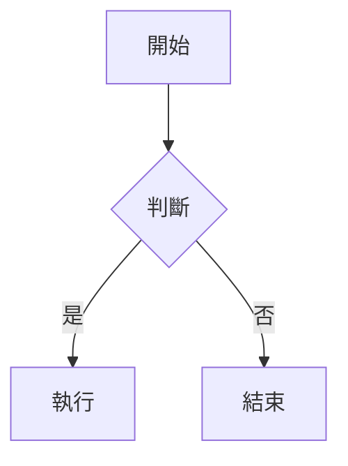

# 🐊 下水道實驗室 - 部署指南

## 快速開始

### 方式 1：使用 npm 腳本（推薦）

```bash
npm run deploy
```

這個命令會自動執行以下步驟：
1. 生成文章索引
2. 複製索引文件到 `docs/` 目錄
3. 提交變更
4. 推送到 GitHub

### 方式 2：使用 Bash 腳本

```bash
./deploy.sh
```

或者：

```bash
bash deploy.sh
```

### 方式 3：手動執行（用於調試）

```bash
# 步驟 1: 生成文章索引
npm run generate

# 步驟 2: 複製索引文件
cp posts/index.json docs/

# 步驟 3: 提交並推送
git add docs/index.json posts/
git commit -m "Update: Add new posts"
git push origin main
```

---

## 工作流程

### 添加新文章

1. **在 `posts/` 目錄中創建新的 Markdown 文件**

   文件名格式：`YYYY-MM-DD-slug.md`
   
   例如：`2026-03-06-my-new-article.md`

2. **編寫文章內容**

   ```markdown
   ---
   title: 我的新文章
   date: 2026-03-06
   category: tech-logs
   tags: [標籤1, 標籤2]
   hero: hero-image.png
   ---

   # 文章標題

   文章內容...
   ```

3. **執行部署命令**

   ```bash
   npm run deploy
   ```

4. **完成！** 

   您的文章會自動出現在首頁上。

---

## Frontmatter 格式

每篇文章的開頭必須包含以下元數據（YAML frontmatter）：

```yaml
---
title: 文章標題（必需）
date: 2026-03-06（必需，格式：YYYY-MM-DD）
category: tech-logs（必需，可選值：tech-logs, device-analysis, life-thoughts）
tags: [標籤1, 標籤2]（可選）
hero: hero-image.png（可選，Hero 圖片文件名）
---
```

### 分類說明

- **tech-logs**：滲透紀錄 - 技術文章、教程、技巧
- **device-analysis**：樣本拆解 - 硬體拆解、產品評測
- **life-thoughts**：生活碎念 - 個人思考、生活分享

---

## 支持的功能

### 1. Markdown 基礎語法

```markdown
# 標題
**粗體** *斜體* ~~刪除線~~

- 列表項 1
- 列表項 2

1. 有序列表 1
2. 有序列表 2

[連結文字](https://example.com)


> 引用文字
```

### 2. 代碼高亮

````markdown
```python
def hello():
    print("Hello, World!")
```

```javascript
console.log("Hello, World!");
```
````

### 3. LaTeX 數學公式

```markdown
行內公式：$E = mc^2$

塊狀公式：
$$
\sum_{i=1}^{n} i = \frac{n(n+1)}{2}
$$
```

### 4. Mermaid 圖表

````markdown

````

### 5. 表格

```markdown
| 列 1 | 列 2 | 列 3 |
|------|------|------|
| 內容 | 內容 | 內容 |
| 內容 | 內容 | 內容 |
```

---

## Hero 圖片

### 添加 Hero 圖片

1. 將圖片放在 `docs/assets/images/` 目錄中
2. 在 frontmatter 中指定圖片文件名：

   ```yaml
   hero: my-hero-image.png
   ```

3. 執行 `npm run deploy` 發佈

### 支持的圖片格式

- `.png`
- `.jpg` / `.jpeg`
- `.gif`
- `.webp`

---

## 評論功能

本部落格使用 **Giscus** 提供評論功能，基於 GitHub Discussions。

### 如何評論

1. 訪問文章頁面
2. 向下滾動到「評論」區域
3. 使用 GitHub 帳號登錄
4. 撰寫並發佈評論

### 評論存儲位置

所有評論都存儲在 GitHub Discussions 中，您可以在倉庫的 Discussions 標籤中查看和管理。

---

## 常見問題

### Q: 執行 `npm run deploy` 時出現錯誤

**A:** 檢查以下幾點：

1. 確保您在項目根目錄
2. 確保已安裝依賴：`npm install`
3. 確保 Git 已配置用戶信息：
   ```bash
   git config user.name "Your Name"
   git config user.email "your.email@example.com"
   ```
4. 確保有網絡連接

### Q: 新文章沒有出現在首頁

**A:** 檢查以下幾點：

1. 文件名格式是否正確（`YYYY-MM-DD-slug.md`）
2. Frontmatter 格式是否正確（特別是冒號後面要有空格）
3. 是否執行了 `npm run deploy`
4. 是否等待了 GitHub Pages 的構建完成（通常需要 1-2 分鐘）

### Q: 如何編輯已發佈的文章

**A:** 

1. 編輯 `posts/` 中的 Markdown 文件
2. 執行 `npm run deploy`
3. 文章會自動更新

### Q: 如何刪除文章

**A:**

1. 刪除 `posts/` 中對應的 Markdown 文件
2. 執行 `npm run deploy`
3. 文章會從首頁消失

---

## 技術細節

### 文件結構

```
alligators-lab-pages/
├── docs/                          # GitHub Pages 發佈目錄
│   ├── index.html                 # 首頁
│   ├── post.html                  # 文章頁面
│   ├── index.json                 # 文章索引（自動生成）
│   ├── css/
│   │   └── style.css              # 樣式表
│   ├── js/
│   │   ├── main.js                # 首頁邏輯
│   │   └── post.js                # 文章頁面邏輯
│   └── assets/images/             # 圖片資源
├── posts/                         # 文章源文件
│   ├── 2026-03-06-article.md      # Markdown 文章
│   └── index.json                 # 文章索引（自動生成）
├── scripts/
│   └── generate.js                # 生成腳本
├── package.json                   # npm 配置
├── deploy.sh                      # Bash 部署腳本
└── README.md                      # 項目說明
```

### 生成流程

1. `generate.js` 掃描 `posts/` 目錄中的所有 `.md` 文件
2. 提取每個文件的 frontmatter 和內容
3. 生成 `posts/index.json`
4. `deploy.sh` 複製 `index.json` 到 `docs/`
5. 前端 JavaScript 加載 `docs/index.json` 並渲染文章列表

---

## 更新日誌

### v1.0.0 (2026-03-06)

- ✅ 初始版本
- ✅ 支持 Markdown 文章
- ✅ 自動生成文章索引
- ✅ 支持分類和標籤
- ✅ 集成 Giscus 評論
- ✅ 暗色主題設計
- ✅ npm 部署腳本

---

## 支持和反饋

如有問題或建議，請在 GitHub 倉庫中提交 Issue：

https://github.com/jimmy0800/alligators-lab-pages/issues

---

**祝您寫作愉快！🐊**
