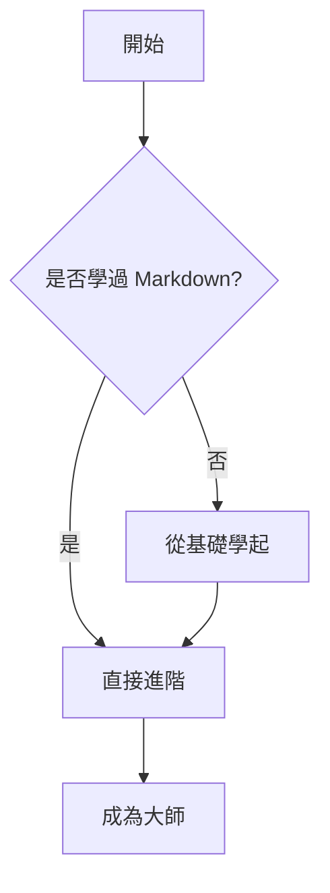

# 🚀 Markdown 完全指南：從寫作到生產力工具

Markdown 不僅僅是「標記語言」，它是現代數位寫作的**通用貨幣**。無論你是要寫程式文件、個人筆記（Obsidian/Notion），還是發佈部落格，掌握 Markdown 都能讓你實現「手不離鍵盤」的高效創作。

---


## 🎯 基礎語法

### 1. 標題與層級

在 `#` 後面**必須加一個空格**，這是標準規範。

```markdown
# 一級標題 (H1) - 建議一份文件只用一個
## 二級標題 (H2) - 章節名稱
### 三級標題 (H3) - 子章節

```

### 2. 文字格式化

| 效果 | 語法 | 快捷鍵建議 |
| --- | --- | --- |
| **粗體** | `**強調內容**` | `Ctrl/Cmd + B` |
| *斜體* | `*斜體內容*` | `Ctrl/Cmd + I` |
| ~~刪除線~~ | `~~錯誤內容~~` | - |
| `行內程式碼` | ``code`` | - |
| <u>底線</u> | `<u>底線內容</u>` | (需 HTML 支援) |

---

## 🔗 連結與多媒體

### 圖片與連結

> **Pro Tip:** 圖片語法只比連結多了一個驚嘆號 `!`。

* **外部連結：** `[顯示文字](URL "懸停提示")`
* **引用連結：** (適合學術引用，保持內文整潔)
```markdown
這是一篇關於 [Markdown][1] 的文章。
[1]: https://zh.wikipedia.org/wiki/Markdown

```


* **圖片：** ``

### 頁內錨點 (Internal Links)

想要跳轉到文件內的某個標題？

```markdown
[點擊跳轉到進階技巧](#-進階技巧)

```

*(註：空格通常轉換為 `-`，且需全小寫)*

---

## 📊 進階技巧：讓文件更專業

### 1. 引用與嵌套

引用可以用來強調金句，或是標註補充資訊。

> **重點提示**
> 這是第一層引用
> > 這是嵌套在內的第二層引用
> 
> 

### 2. 反斜線轉義 (Escaping)

如果你想在頁面上顯示 `*` 而不是讓文字變斜體，請使用反斜線 `\`：
`\*這不是斜體\*` -> *這不是斜體*

### 3. HTML 標籤支援

Markdown 支援原生 HTML，這在調整版面時非常有用：

* **換行：** 使用 `<br>`。
* **文字顏色：** `<span style="color:red">紅色文字</span>`。
* **置中：** `<center>文字內容</center>`。

---

## 🎨 現代擴展：圖表與數學公式

### 1. 數學公式 (LaTeX)

適合學術與工程計算：

* **行內公式：** $E = mc^2$
* **塊狀公式：**

$$\sum_{i=1}^{n} i = \frac{n(n+1)}{2}$$

### 2. Mermaid 圖表 (現代編輯器必備)

許多平台 (GitHub, Obsidian, VS Code) 支援 Mermaid 語法來繪製流程圖。





---

## 🛠️ 工具推薦：挑選你的專屬武器

| 類型 | 軟體名稱 | 最強特點 |
| --- | --- | --- |
| **全能王者** | **VS Code** | 插件極多 (Markdown All in One)，適合工程師 |
| **沈浸寫作** | **Typora** | 所見即所得 (WYSIWYG)，介面極簡美觀 |
| **知識管理** | **Obsidian** | 強大的雙向連結與插件生態，打造第二大腦 |
| **雲端協作** | **HackMD** | 支援即時多人編輯，對開發者非常友善 |
| **輕量筆記** | **Notion** | 結合資料庫功能，適合專案管理 |

---

## 💡 最佳實踐與避坑指南

1. **空格的藝術**：
* 標題 `#` 後面一定要加空格。
* 列表 `-` 後面也要加空格。
* 中英文混排時，在中文與英文/數字間加一個空格，閱讀感更佳（例如：這是一個 Markdown 教學）。


2. **程式碼塊一定要標註語言**：
這樣不僅有語法高亮，對搜尋引擎也更友好。
3. **不要過度嵌套**：
超過三層的列表或引用會讓手機端閱讀變得非常痛苦。


## 📚 學習資源

- [Markdown 官方網站](https://daringfireball.net/projects/markdown/)
- [GitHub Flavored Markdown](https://github.github.com/gfm/)
- [CommonMark 規範](https://spec.commonmark.org/)
- [Markdown 教程](https://www.markdowntutorial.com/)

## 🎓 總結

Markdown 是現代寫作和文檔編寫的必備技能。通過掌握本文介紹的語法和最佳實踐，您可以：

✅ 快速撰寫格式化文檔
✅ 輕鬆進行版本控制
✅ 與他人協作編輯
✅ 轉換為多種輸出格式

現在就開始使用 Markdown 吧！

---

